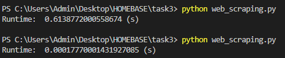

# TAKE HOME ASSIGNMENT - HOMEBASE

## DESCRIPTION
This repository stores my submission to HOMEBASE recruitment's take home assignment. Which includes of 5 tasks:

1. Python Programming - Average Age Calculator: This task mainly focus on testing my ability in basic use of python.

2. Data Structures - E-commerce Inventory Schema: This task tests my understanding of data structures uses in database schema design.

3. Web Scraping - Real Estate Data from Batdongsan.com: This task test my knowledge in web scraping and understanding in caching technique.

But since the link given in the original file does not have any available data to scratch, i assume it to be a typo and conducted scraping on the website "batdongsan.com.vn" instead.

4. Nested Set Model Implementation: This task test my Data Structure and Algorithms ability.

5. Database and SQL - Stored Procedure Creation: This task test my SQL understanding and implementation ability.

## USAGE

All folders contain the source code and a README with instructions on how to run the code, explanations and additional comments respectively.

## RESULTS:
For the python programming tasks 1, 3, and 4, results image are as below:

1. Average Age Calculator: 

2. Web Scraping with cache

3. Nested Set Implementation
